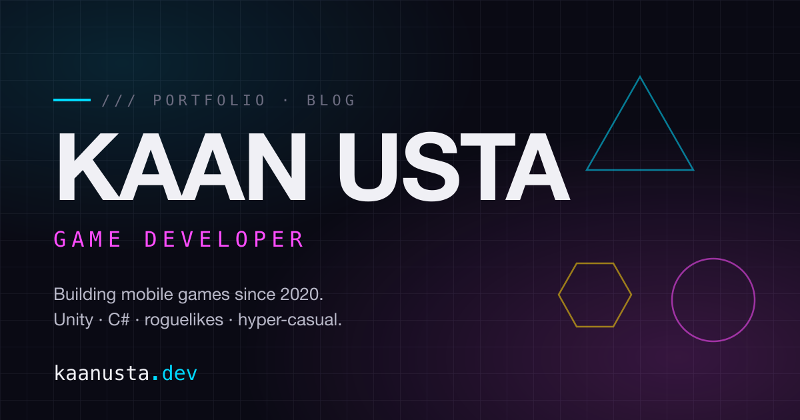

# kaanusta.dev

Personal portfolio and blog for **Kaan Usta** — game developer, Unity / C#, mobile-focused.

**Live:** [kaanusta.dev](https://kaanusta.dev)



## Highlights

- ⚡ **Lighthouse 100 / 100 / 100 / 100** on both mobile and desktop (Performance, Accessibility, Best Practices, SEO)
- 🎮 Six game projects with cover + gallery + lazy-embedded YouTube trailers
- 🪟 Project modal that fetches and injects detail pages over the home view, with full deep-link + View Transitions support
- 🎨 Custom CSS parallax hero, scroll-in animations, optional crosshair cursor and 8-bit Web Audio sound FX
- 🌙 Dark-first design with a small cyan / magenta / amber accent palette

## Stack

- [Astro 5](https://astro.build) static site + content collections
- [Tailwind CSS](https://tailwindcss.com) (custom theme in `tailwind.config.mjs`, CSS variables in `src/styles/global.css`)
- TypeScript
- Self-hosted [Inter](https://rsms.me/inter/) + [JetBrains Mono](https://www.jetbrains.com/lp/mono/) via `@fontsource`
- GitHub Pages + GitHub Actions for deploy

## Local development

```sh
npm install
npm run dev              # http://localhost:4321
npm run dev -- --host    # also expose on LAN for phone testing
npm run build            # production build to dist/
npm run preview          # serve the production build locally
```

## Project structure

```
src/
  content/
    projects/     # one markdown file per game (frontmatter-driven)
    blog/         # blog posts
  assets/
    projects/     # per-project cover + gallery images
    portrait.png
  components/     # Header, Footer, Hero, ProjectCard, ProjectModal, ...
  layouts/        # BaseLayout (head, nav, footer), ProjectLayout
  pages/          # routes (index, projects, blog)
  styles/
    global.css    # CSS variables, @layer components, prose styles
  lib/
    constants.ts  # site + social + nav + stats
public/
  favicon.svg
  og-image.png
  scripts/        # is:inline JS (project modal)
scripts/
  og-image.svg    # source for the OG image — regenerate with sharp
```

## Adding a project

1. Drop cover + gallery images under `src/assets/projects/<slug>/` (cover.png, gallery/01.png, ...)
2. Create `src/content/projects/<slug>.md` — match the frontmatter schema defined in `src/content.config.ts` (title, platform, genres, year, duration, role, description, techStack, links, coverImage, gallery, youtubeId, featured, order)
3. `npm run build` — the schema validates everything at build time

## Adding a blog post

1. Create `src/content/blog/<slug>.md` with title / description / pubDate / tags
2. Write in Markdown (or MDX if you need components)

## Regenerating the OG image

Edit `scripts/og-image.svg`, then:

```sh
node -e "require('sharp')(require('fs').readFileSync('scripts/og-image.svg')).flatten({background:'#0a0a14'}).jpeg({quality:88,mozjpeg:true}).toFile('public/og-image.jpg')"
```

## Deployment

Pushing to `main` triggers `.github/workflows/deploy.yml`, which builds with Astro and publishes to GitHub Pages. Working branch is `dev/claude` — PRs land on `main` and deploy follows automatically.

## License

© Kaan Usta. All rights reserved. The source is public so you can read and learn from it, but code, design, images, and written content may not be reused without permission.
